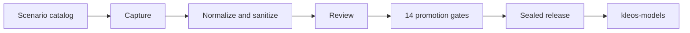

<div align="center">

# KLEOS Training Data

A Python pipeline that generates, screens and versions synthetic fine-tuning
data for KLEOS.

[](https://github.com/TejasNaik24/Kleos-Training-Data/actions/workflows/ci.yml)
[](pyproject.toml)
[](LICENSE)
[](https://github.com/astral-sh/ruff)
[](https://mypy-lang.org/)

</div>

KLEOS is an AI operating system for computer science students, live at
[kleos-cs.vercel.app](https://kleos-cs.vercel.app). This repository builds the
datasets used to fine-tune its decision-making models. Every example is generated
from a scenario with fictional entities, every answer is computed from an
explicit decision policy, and every release is immutable and content-hashed. Two
models fine-tuned on the current release raised a composite policy score from
0.47 to 0.80 on held-out prompts in an input format they never saw during
training ([results and caveats](#results)).

| Examples | Tasks | Scenario families | Decision policies | Promotion gates | Tests |
| :---: | :---: | :---: | :---: | :---: | :---: |
| 1,350 | 7 | 18 | 12 | 14 | 1,165 |

## Contents

- [Overview](#overview)
- [Key features](#key-features)
- [Results](#results)
- [Limitations](#limitations)
- [Architecture](#architecture)
- [Example](#example)
- [Tech stack](#tech-stack)
- [Getting started](#getting-started)
- [Usage](#usage)
- [Dataset releases](#dataset-releases)
- [Project structure](#project-structure)
- [Testing and quality](#testing-and-quality)
- [Documentation](#documentation)
- [Related projects](#related-projects)
- [Contributing and security](#contributing-and-security)
- [License](#license)
- [Author](#author)

## Overview

KLEOS makes judgment calls for its users: which notification needs attention
first, which source can answer a question, which of two conflicting records to
trust, and when to ask instead of guessing. Fine-tuning should teach those
decisions without teaching anything about the people who use the product.

> Train a generalizable decision policy, not private facts about a person.

| Teaches a policy | Teaches a private fact |
| --- | --- |
| "When one task has a nearer deadline, confirmed evidence that it matters and a higher cost of delay, rank it first and name the factor that decided it." | "Prioritize the robotics project. Marcus Holloway's internship at Acme Labs ends in three weeks." |

The datasets cover seven tasks: notification prioritization, tool routing,
mission control briefing, context prioritization, recommendation generation,
memory conflict resolution and workspace reasoning. Each example starts as a
scenario with fictional entities, and one of 12 decision policies computes its
answer. The example then passes through the same stages a real capture would: a
capture step that imitates the streaming responses of the KLEOS backend,
normalization, privacy sanitization, a recorded review decision and 14 promotion
gates.

## Key features

- **Computed targets.** Every answer is rendered from the decision of one of 12
  registered policies, such as ranking by cost of delay, trusting a
  well-supported record over a newer one, or asking before crossing a workspace
  boundary. Paraphrased, reordered and noisier variants of each example must
  produce the same decision, or generation fails.
- **Layered privacy.** 28 detection rules for secrets and personal data, an
  entity vault for real names that no pattern can find, and a private-fact
  assessment that flags answers asserting facts about people. Detected values are
  replaced with consistent fictional surrogates.
- **Promotion gates.** 14 gates check record integrity, schema, IDs, privacy,
  review, provenance, duplication, evaluation leakage and contract rendering.
  13 are mandatory, and a promotion policy that bypasses one cannot be
  constructed.
- **Content-bound review.** A decision record carries a digest of the exact
  content it approves, so editing a candidate afterwards invalidates the
  approval.
- **Reproducible releases.** Holdouts are declared before any split runs.
  Releases are content-hashed, read-only and verified by 32 checks, and a fresh
  clone rebuilds the split files of the current release byte for byte.
- **Verified contract, offline pipeline.** The kleos-models dataset contract is
  mirrored and checked against a pinned commit by differential tests. Every
  stage runs without credentials, and CI rebuilds and verifies a complete
  release on every push to `main`.

## Results

Datasets from this pipeline support the research in
[kleos-models](https://github.com/TejasNaik24/Kleos-Models), which asks whether a
behaviorally fine-tuned open-weight model can outperform a prompt-engineered
orchestration baseline. Two models were fine-tuned with QLoRA on
`kleos-policy-v0.0.6` and evaluated on its 349-example test split, where every
prompt uses the JSON input format that training never included. The score is a
composite of ranking, deciding factor and abstention, and each task was tested
separately with a paired bootstrap.

| Base model | Baseline | Fine-tuned | Tasks improved | Date |
| --- | ---: | ---: | --- | --- |
| Ministral-8B-Instruct-2410 | 0.4744 | 0.8015 | 7 of 7, each p < 0.05 | 2026-09-15 |
| Mistral-Nemo-Instruct-2407 (12B) | 0.4755 | 0.8051 | 7 of 7, each p < 0.001 | 2026-09-22 |

The baseline is the same base model driven by KLEOS's prompt-engineered
orchestration. The kleos-models study reports these caveats:

- Each model was trained once.
- The runs departed from the pre-registered protocol, including a format holdout
  in place of the planned entity holdout and a composite grader added during the
  study.
- 78 of the 349 test cases (22%) expect a deciding-factor label that never
  appears in the training targets.
- Neither the baselines nor the fine-tuned models produced valid JSON output, so
  the score measures decisions and leaves output format out.
- The gap between in-distribution and out-of-distribution performance could not
  be measured, because the whole test split is out of distribution.
- In the consistency evaluation, 10 of 15 groups still change their answer under
  paraphrase or evidence reordering, and `context_prioritization` has only 8
  test cases.

The full analysis is in the kleos-models
[experiments document](https://github.com/TejasNaik24/Kleos-Models/blob/main/docs/experiments.md#deviations-log),
and the implications for the dataset are in the
[research protocol](docs/research-protocol.md#status-after-the-first-training-runs).

## Limitations

- Releases are build artifacts. They are git-ignored and not distributed through
  this repository, and `make slice` builds one locally.
- Current releases evaluate one kind of shift, an unseen input format. Entity-pool
  and domain holdouts are declared in the catalog but not yet generated.
- Abstention labels appear only in JSON-format answers, which the format holdout
  places entirely in the test split. Exposing them in every answer format is
  planned for the next release.
- The approvals in the current release were recorded in bulk from the machine
  review's gate results. A 141-example human review sample is prepared but not
  yet completed.
- The capture CLI runs the mock backend only. Adapters for the live KLEOS backend
  exist but are not yet connected to an HTTP transport.

## Architecture



| Zone | Contents | In git |
| --- | --- | --- |
| `scenarios/` | Scenario families | Yes |
| `staging/` | Captures, candidates, review records and the promoted pool | No |
| `vault/` | Entity vault | No |
| `releases/` | Sealed releases | No |
| `reports/` | Generated reports | No |

Each stage writes typed, hash-verified records, and releases are consumed by
kleos-models as a directory path. The full design is in
[docs/architecture.md](docs/architecture.md).

## Example

A training example from `kleos-policy-v0.0.6` (scenario family
`wsp.scope_boundary`, ID `kx-wsr-b022e7bb915eca9e`). The item with the strongest
evidence belongs to another workspace, so the answer ranks only the items in the
active workspace and flags that one instead of acting on it.

<details>
<summary>Show the conversation</summary>

System:

```text
You work inside the workspace the user named. Workspaces are context boundaries: answer from the active one, and when something relevant sits in another workspace, say so explicitly rather than acting on it or silently ignoring it. Do not carry content across a boundary the user did not open. Name the factor that decided it.
```

User:

```text
Active workspace: School

Foxglove is due in about 2 weeks. It is confirmed directly by the owner, and it is low impact. It is blocked on one outstanding answer. [workspace: other — outside the one you named] Grayling is due in about 1 week. It is corroborated by two independent sources, and it is medium impact. Nothing has moved on it in two weeks. [workspace: School] Ravensworth is due in 4 days. It is corroborated by two independent sources, and it is medium impact. It was reopened after being marked complete. [workspace: School]

Working only in the workspace I named — what should I do first?
```

Assistant:

```text
Start with Ravensworth — in the active workspace; due in 4 days. Then Grayling, then Foxglove. Scope decides before anything else: Foxglove sits in another workspace, so it is flagged rather than acted on, and the ranking runs over the 2 items inside School.
```

</details>

The record format is specified in [DATASET_CONTRACT.md](DATASET_CONTRACT.md).

## Tech stack

| Area | Technology |
| --- | --- |
| Language | Python 3.11+ |
| Data models and validation | [](https://docs.pydantic.dev/) [](https://json-schema.org/) |
| Scenario catalog | [](https://pyyaml.org/) |
| Backend capture (optional) | [](https://www.python-httpx.org/) |
| Machine review (optional) | [](https://github.com/anthropics/anthropic-sdk-python) |
| Testing | [](https://docs.pytest.org/) |
| Linting, formatting and type checking | Ruff and mypy |
| Continuous integration | [](.github/workflows/ci.yml) |
| Build and task running | Hatchling and [](Makefile) |

## Getting started

### Prerequisites

- Linux or macOS
- Python 3.11 or newer
- git and make

### Installation

```bash
git clone https://github.com/TejasNaik24/Kleos-Training-Data.git
cd Kleos-Training-Data
make install
source .venv/bin/activate
make check
```

`make install` creates `.venv` and installs the package with the development
tools. To use a specific interpreter, run `make install PYTHON=python3.12`.
`make check` runs the repository secret scan, linting, the format check, type
checking and the tests.

### Build a release end to end

```bash
make slice-clean slice
```

This runs the whole pipeline offline against the full scenario catalog:
validation, mock capture, normalization, sanitization, a review packet, the mock
machine review, a decision for every candidate, promotion, release building,
verification, a coverage report and a compatibility check. It takes about five
minutes.

- **At commit `c5cc730`,** before policy reasoning was added, it reproduces
  `kleos-policy-v0.0.6` byte for byte. The split files and the content hash
  `3cc9a744…` are identical, and the manifest differs only in its name,
  description and timestamps.
- **From the reasoning change on,** it builds the `kleos-policy-v0.0.7` shape. The
  test split is still byte-identical to v0.0.6's. Train and validation answers
  carry `reasoning` and a deciding-factor line.

`make slice-clean` deletes the repository's `staging/` contents and
`data/id_ledger.json`, so run it only in a fresh clone.

The release is written to `releases/kleos-policy-v0.0.1`. That default name is
unrelated to the historical v0.0.1 release, and `SLICE_VERSION=<name>` sets
another.

> [!WARNING]
> `make slice-clean` deletes the contents of `staging/`, the release named by
> `SLICE_VERSION` and the ID ledger `data/id_ledger.json` before rebuilding. Run
> it only in a workspace whose staged data you do not need.

`make slice` records an approval for every candidate from the machine review's
gate results, which suits a pipeline test. A release for training should have
decisions recorded by a person, as described in [docs/review.md](docs/review.md).

### Configuration

Every variable is optional, and the offline pipeline needs none of them.
Nothing loads `.env` automatically: copy `.env.example` to `.env`, fill in what
you need, and load it into your shell with `set -a; . ./.env; set +a`.

<details>
<summary>Environment variables</summary>

| Variable | Purpose | Read by |
| --- | --- | --- |
| `KLEOS_TRAINING_DATA_ROOT` | Workspace root | Scripts that read or write the workspace |
| `KLEOS_STAGING_DIR`, `KLEOS_VAULT_DIR`, `KLEOS_RELEASES_DIR`, `KLEOS_REPORTS_DIR` | Zone locations, relative to the workspace root | Scripts that read or write the workspace |
| `KLEOS_DATA_LOG_LEVEL` | Log level. Overrides `-v` and `-q`. | All pipeline scripts |
| `KLEOS_MODELS_PATH` | Local kleos-models checkout for compatibility checks and evaluation fixtures | `check_contract_compat.py`, `make slice`, `doctor.py` |
| `KLEOS_ALLOW_PRODUCTION_CAPTURE` | One of the four conditions for a non-local capture | `capture_backend.py`, `doctor.py` |
| `ANTHROPIC_API_KEY` | The `anthropic` machine reviewer | `run_llm_review.py`, `doctor.py` |
| `KLEOS_BACKEND_URL`, `KLEOS_API_TOKEN`, `KLEOS_TRAINING_DATA_ENV` | Reported by the environment diagnostic | `doctor.py` |

`.env.example` also lists `KLEOS_TIMEOUT_SECONDS`, `KLEOS_MAX_RETRIES`,
`KLEOS_REQUESTS_PER_MINUTE` and `KLEOS_MAX_CONCURRENCY`. The current code does
not read them. The HTTP transport uses fixed defaults.

</details>

## Usage

Each stage is a script in `scripts/`. This sequence builds a release step by
step in a fresh workspace:

```bash
python scripts/init_workspace.py
python scripts/validate_scenarios.py --strict
python scripts/capture_backend.py --adapter mock --out-batch batch-001
python scripts/normalize_captures.py --batch batch-001
python scripts/sanitize_candidates.py --batch batch-001
python scripts/build_review_packet.py --batch batch-001
python scripts/run_llm_review.py --packet-id pk-batch-001 --reviewer mock
python scripts/record_decision.py --candidate <candidate-id> --decision approve --adopt-machine-gates
python scripts/promote_examples.py --batch batch-001
python scripts/build_release.py --version kleos-policy-v0.0.7 --holdout-attribute format
python scripts/verify_release.py --release releases/kleos-policy-v0.0.7 --strict
python scripts/coverage_report.py --release releases/kleos-policy-v0.0.7
python scripts/check_contract_compat.py --release releases/kleos-policy-v0.0.7
```

Run `record_decision.py` once per candidate. Candidate IDs are the record names
in `staging/sanitized/batch-001/`, excluding the `.privacy.json` sidecars. On a
workspace where `make slice` has already promoted the catalog, promotion rejects
the same examples as duplicates, so run `make slice-clean` first.

Every script accepts `--help`. Shared options and exit codes are listed in
[docs/architecture.md](docs/architecture.md#cli-conventions).

## Dataset releases

| Version | Date | Examples | Train / val / test | Families | Policies | Highlights |
| --- | --- | ---: | --- | ---: | ---: | --- |
| v0.0.6 | 2026-09-04 | 1,350 | 820 / 181 / 349 | 18 | 12 | Relative close-call margin, split ask policies, stale-statement handling |
| v0.0.5 | 2026-09-03 | 1,254 | 774 / 166 / 314 | 17 | 10 | 32 examples removed after human review |
| v0.0.4 | 2026-09-01 | 1,286 | 793 / 169 / 324 | 17 | 10 | Difficulty derived from each policy |
| v0.0.3 | 2026-09-01 | 1,286 | 793 / 169 / 324 | 17 | 10 | Workspace and routing corrections |
| v0.0.2 | 2026-09-01 | 1,152 | 721 / 157 / 274 | 17 | 9 | First full catalog |
| v0.0.1 | Not recorded | 150 | 90 / 10 / 50 | 7 | 6 | End-to-end pipeline test |

Every release holds out the JSON input format for testing, uses split seed 42
and contains only synthetic examples. v0.0.6 is the current release. Its
approvals were recorded from the machine review's results and its human review
sample has not been completed, so it is marked as a candidate. The
[CHANGELOG](CHANGELOG.md) has the details and content hash of each release.

## Project structure

```text
.
├── .github/workflows/ci.yml       CI pipeline
├── data/surrogates/               Fictional name pools
├── docs/                          Design and reference documentation
├── scenarios/                     Scenario families, one directory per task
├── scripts/                       Pipeline command-line tools
├── src/kleos_training_data/
│   ├── collection/                Capture adapters, HTTP transport, production guard
│   ├── contract/                  Mirrored kleos-models contract
│   ├── datasets/                  Holdouts, sealing and verification
│   ├── privacy/                   Detection, redaction and surrogates
│   ├── promotion/                 Promotion gates and policy
│   ├── quality/                   Coverage reporting
│   ├── review/                    Rubric, packets, reviewers and decisions
│   ├── scenarios/                 Scenario models, policies, generation, rendering
│   └── staging/                   Records, storage and normalization
├── tests/                         Test suite
├── Makefile                       Development and pipeline tasks
└── pyproject.toml                 Package metadata and tool configuration
```

The runtime zones `staging/`, `vault/`, `releases/` and `reports/` are created
by `scripts/init_workspace.py` and are git-ignored.

## Testing and quality

```bash
make check
```

| Target | Runs |
| --- | --- |
| `make check` | The repository secret scan, lint, format check, type check and tests |
| `make test` | The test suite (1,165 tests) |
| `make lint`, `make typecheck` | Ruff and mypy |
| `make scenarios` | Scenario catalog validation |
| `make compat` | The kleos-models compatibility check. Requires `make install-compat`. |
| `make coverage` | Dataset coverage of the promoted pool |
| `make privacy` | The repository scan for secrets and personal data |

| CI job | Runs |
| --- | --- |
| Private-data scan | `check_no_private_data.py`, before any dependency is installed |
| Lint | `ruff check` and `ruff format --check` |
| Typecheck | `mypy src/kleos_training_data` |
| Test | `pytest` on Python 3.11, 3.12 and 3.13 |
| Workspace and ignore rules | `init_workspace.py`, then fails if any runtime-zone file could be committed |
| Contract compatibility | The differential tests and `check_contract_compat.py --strict` against kleos-models at the pinned commit |
| Vertical slice | An end-to-end build with `make slice-clean slice`, then `verify_release.py --strict` on the result |

## Documentation

| Document | Contents |
| --- | --- |
| [docs/architecture.md](docs/architecture.md) | Workspace zones, pipeline stages, design principles and CLI conventions |
| [docs/scenarios.md](docs/scenarios.md) | Scenario catalog, YAML field reference, policies and authoring guide |
| [docs/collection.md](docs/collection.md) | Capture lanes, adapters, the production guard and the HTTP transport |
| [docs/staging.md](docs/staging.md) | Staging records, normalization, promotion gates and rejection codes |
| [docs/privacy.md](docs/privacy.md) | Detection rules, surrogates and private-fact signals |
| [docs/review.md](docs/review.md) | Review rubric, review hard gates, decision records and packets |
| [docs/dataset-lifecycle.md](docs/dataset-lifecycle.md) | Splitting, holdouts, sealing, verification and versioning |
| [docs/compatibility.md](docs/compatibility.md) | The mirrored kleos-models contract and its checks |
| [docs/research-protocol.md](docs/research-protocol.md) | The research claim, falsification criteria and current status |
| [docs/incident-response.md](docs/incident-response.md) | Runbooks for exposed secrets, personal data and consent problems |
| [DATASET_CONTRACT.md](DATASET_CONTRACT.md) | The release format kleos-models expects |
| [PRIVACY.md](PRIVACY.md) | The privacy policy, guarantees and limitations |
| [DATA_GOVERNANCE.md](DATA_GOVERNANCE.md) | Custody, distribution, retention and deletion requests |
| [SECURITY.md](SECURITY.md) | Vulnerability reporting and credential handling |
| [CONTRIBUTING.md](CONTRIBUTING.md) | Development setup and conventions |
| [CHANGELOG.md](CHANGELOG.md) | Pipeline and dataset release history |

## Related projects

- [kleos-models](https://github.com/TejasNaik24/Kleos-Models): dataset
  validation, QLoRA fine-tuning and the evaluation harness behind the results
  above.
- [KLEOS](https://kleos-cs.vercel.app): the AI operating system for computer
  science students that these datasets are built for.

## Contributing and security

Contributions are welcome. [CONTRIBUTING.md](CONTRIBUTING.md) covers setup and
conventions. Report security or privacy issues privately as described in
[SECURITY.md](SECURITY.md) rather than in a public issue.

## License

Released under the [MIT License](LICENSE).

## Author

Tejas Naik ([@TejasNaik24](https://github.com/TejasNaik24))
