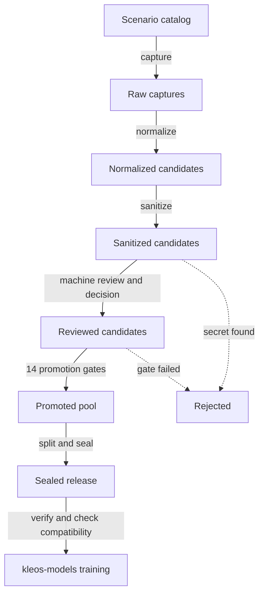

# Architecture

KLEOS Training Data is a staged pipeline. A catalog of declared scenarios is
turned into captures, sanitized and reviewed candidates, a promoted pool, and
finally an immutable release that kleos-models trains on. This document covers
the workspace layout, the pipeline stages, the design principles, the module
layout and the command-line conventions.

## Contents

- [Workspace zones](#workspace-zones)
- [Pipeline](#pipeline)
- [Design principles](#design-principles)
- [Module map](#module-map)
- [CLI conventions](#cli-conventions)
- [Integration with kleos-models](#integration-with-kleos-models)

## Workspace zones

Each zone holds one kind of artifact and has its own git policy.

| Zone | Holds | Tracked in git |
| --- | --- | --- |
| `scenarios/` | Scenario families (YAML) | Yes |
| `data/surrogates/` | Fictional name pools used for items and surrogates | Yes |
| `staging/` | Captures, candidates, review records, rejections and the promoted pool | No |
| `vault/` | The entity vault (directory mode 0700) | No |
| `releases/` | Sealed releases | No |
| `reports/` | Coverage, deduplication, leakage, review and gate reports, which may quote candidate text | No |

The four runtime zones are git-ignored with deny-by-default rules that keep only
a top-level `.gitkeep`. `scripts/init_workspace.py` creates the zones and asks
git whether their contents would be ignored, and `tests/test_gitignore.py`
checks the rules against a real git repository, including what `git add -A`
would stage.

## Pipeline



| Stage | Script | Writes |
| --- | --- | --- |
| Validate the catalog | `validate_scenarios.py` | Nothing. Reports problems. |
| Capture | `capture_backend.py` | `staging/raw/<batch>/` |
| Normalize | `normalize_captures.py` | `staging/normalized/<batch>/` |
| Sanitize | `sanitize_candidates.py` | `staging/sanitized/<batch>/`, rejections for secrets |
| Build a review packet | `build_review_packet.py` | `staging/review/packets/` |
| Machine review | `run_llm_review.py` | `staging/review/llm/` |
| Record decisions | `record_decision.py` | `staging/review/decisions/` |
| Promote | `promote_examples.py` | `staging/promoted/` or `staging/rejected/` |
| Build a release | `build_release.py` | `releases/<version>/` |
| Verify | `verify_release.py`, `check_contract_compat.py`, `coverage_report.py` | Reports only |

Each stage reads the records written by the previous one, and every rejection is
recorded with a reason code from a closed vocabulary.

## Design principles

| Decision | Reason | Enforced by | Tested in |
| --- | --- | --- | --- |
| Training targets are computed by registered policies | No model output becomes a target, perturbations can be checked, and the stated reason is the one that decided | `scenarios/policies.py`, `scenarios/generator.py` | `tests/test_scenarios.py`, `tests/test_repaired_policies.py` |
| The kleos-models contract is mirrored, not imported | The pipeline builds and tests without kleos-models, and drift is detected | `contract/`, `contract/pin.py` | `tests/test_differential_contract.py`, `tests/test_compat.py` |
| Invalid states cannot be constructed | A rule holds on every code path, not only where a check is called | Validators on `ReviewVerdict`, `HumanDecision` and `PromotionPolicy` | `tests/test_review.py`, `tests/test_promotion.py` |
| IDs derive from content | Re-reviewing an example keeps its ID, and editing it changes the ID | `ids.py` | `tests/test_ids.py` |
| Records are hash-verified on read | Content edited after review cannot be promoted | `staging/store.py` | `tests/test_staging.py` |
| Releases are immutable | A version name always refers to the same bytes | `datasets/release.py`, `datasets/verify.py` | `tests/test_datasets.py` |
| Every stage runs offline | The pipeline is testable without credentials or a network | Mock adapter, mock reviewer | CI `vertical slice` job |

## Module map

| Package or module | Responsibility |
| --- | --- |
| `contract/` | Mirrored kleos-models contract: schemas, JSONL writer, splitter, deduplication, the pin and compatibility checks |
| `scenarios/` | Scenario models and loader, situations and framings, policies, derived difficulty, generation, rendering and surrogate pools |
| `collection/` | Capture adapters, HTTP transport, production guard and capture runner |
| `staging/` | Record types, atomic hash-verified storage, normalization and rejection codes |
| `privacy/` | Detection rules, entity vault, redaction, surrogate substitution and private-fact assessment |
| `review/` | Rubric, review packets, machine reviewers, decision records and the review response schema |
| `promotion/` | Gate table, promotion policy, runner and per-candidate context |
| `datasets/` | Holdouts, manifests, sealing and verification |
| `quality/` | Coverage reporting |
| `errors.py` | Exception types and exit codes |
| `hashing.py` | Canonical JSON, hashing, stable ranking and text normalization |
| `ids.py` | Content-derived example IDs |
| `logging_utils.py` | Logging setup, `redact()` and `SafeSecret` |
| `paths.py` | Workspace and zone resolution |

All packages live under `src/kleos_training_data/`.

## CLI conventions

Every pipeline step is a script in `scripts/`:

| Script | Purpose |
| --- | --- |
| `init_workspace.py` | Create the runtime zones and verify the ignore rules. `--check` only reports. |
| `doctor.py` | Report the environment, dependencies and workspace state without printing secret values |
| `validate_scenarios.py` | Validate the scenario catalog |
| `capture_backend.py` | Capture a batch |
| `normalize_captures.py` | Normalize a batch |
| `sanitize_candidates.py` | Sanitize a batch, or add entity-vault entries |
| `build_review_packet.py` | Build a review packet |
| `run_llm_review.py` | Run a machine review over a packet |
| `record_decision.py` | Record a decision for one candidate |
| `promote_examples.py` | Run the promotion gates on a batch |
| `build_release.py` | Split the promoted pool and seal a release |
| `verify_release.py` | Verify a sealed release |
| `coverage_report.py` | Report coverage of a release or of the promoted pool |
| `check_contract_compat.py` | Compare the mirrored contract with kleos-models |
| `check_no_private_data.py` | Scan the repository for secrets and personal data, or install the pre-commit hook |

Run any script with `--help` for its options. Common conventions:

| Convention | Behavior |
| --- | --- |
| Verbosity | `-v` enables debug logging and `-q` shows only warnings and errors. `check_no_private_data.py` has neither. |
| Log level override | `KLEOS_DATA_LOG_LEVEL`, when set to a valid level name, overrides `-v` and `-q` |
| Log output | Standard error |
| Workspace | `--workspace` (`--root` for `init_workspace.py`), then `KLEOS_TRAINING_DATA_ROOT`, then the repository root |
| Zone locations | `KLEOS_STAGING_DIR`, `KLEOS_VAULT_DIR`, `KLEOS_RELEASES_DIR` and `KLEOS_REPORTS_DIR`, resolved against the workspace root when relative |

| Exit code | Meaning |
| ---: | --- |
| 0 | Success |
| 1 | Error, such as missing input or an invalid configuration |
| 2 | Invalid command-line usage |
| 3 | A validation, promotion gate or verification check failed |
| 4 | A privacy violation, such as a secret or undeclared personal data |
| 130 | Interrupted |

## Integration with kleos-models

The repositories share no code at runtime. kleos-models consumes a release as a
directory:

```bash
python ../Kleos-Models/scripts/train.py --config <config> --dataset releases/kleos-policy-v0.0.6
```

This repository keeps its copy of the dataset contract in sync through the
pinned commit and the checks described in [compatibility.md](compatibility.md).

## Related documentation

- [staging.md](staging.md): records and the promotion gates
- [dataset-lifecycle.md](dataset-lifecycle.md): releases from split to hand-off
- [scenarios.md](scenarios.md): the scenario catalog and policies
- [../DATASET_CONTRACT.md](../DATASET_CONTRACT.md): the release format
